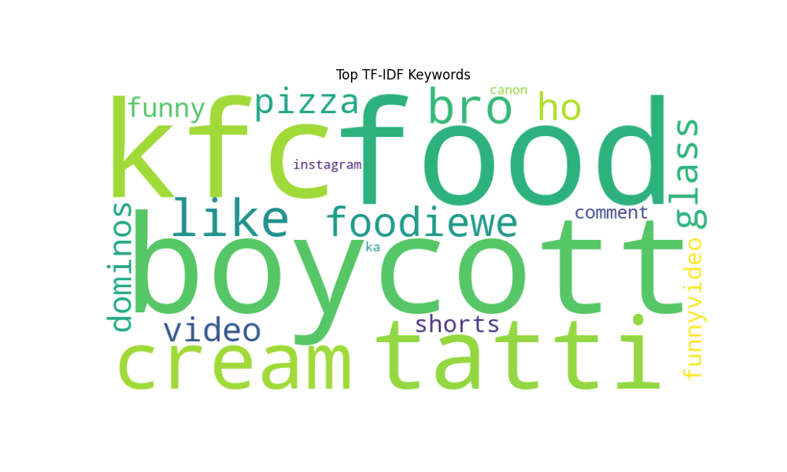
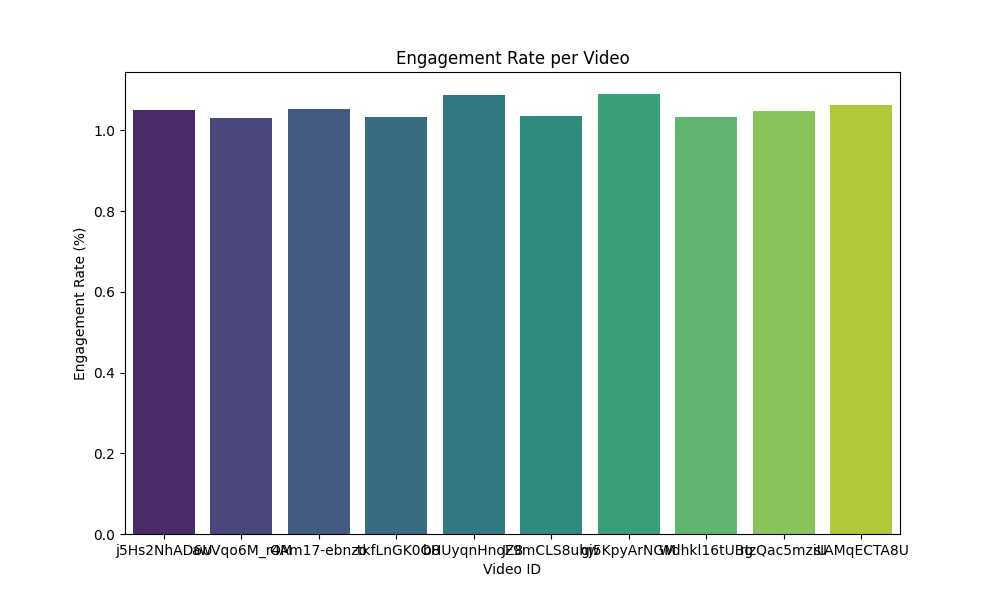
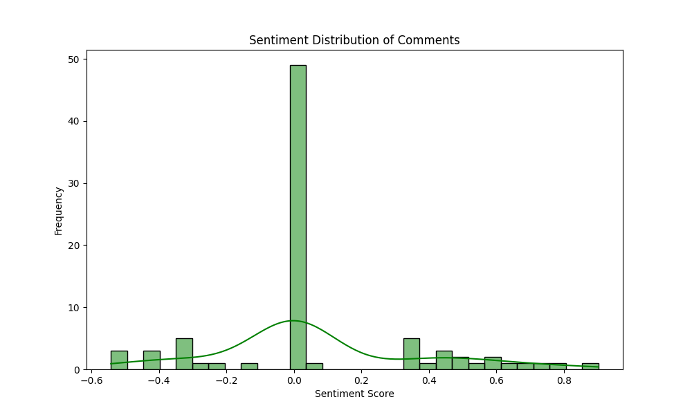
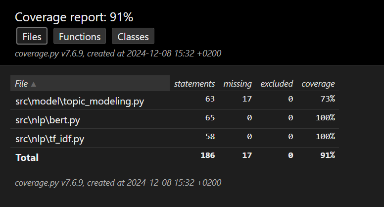
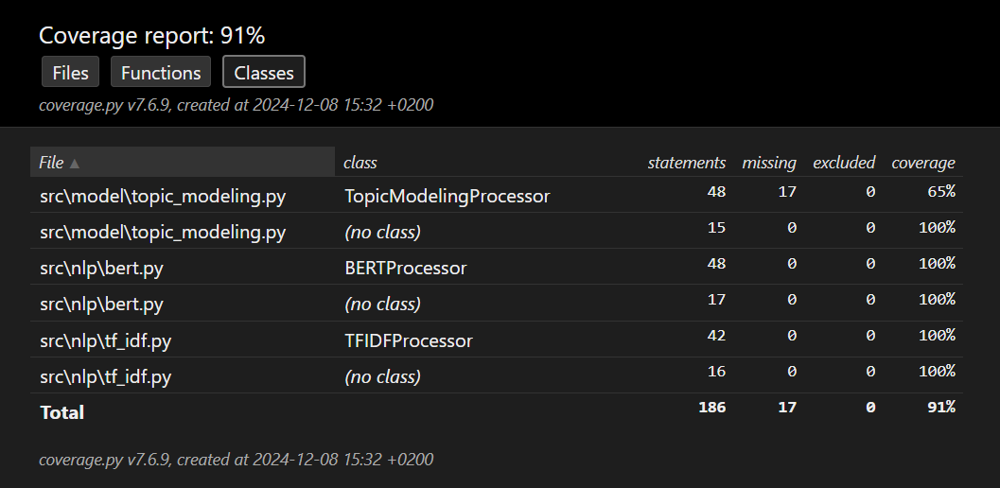

# YouTube Channel Analysis Dashboard

## Overview
A Flask-based web application that leverages the YouTube Data API to analyze YouTube channels. This project allows users to:
- Analyze channel metrics like subscriber count, video count, and overall engagement.
- Extract insights from top-performing videos and their comments.
- Perform NLP-based keyword extraction and sentiment analysis using TF-IDF and BERT.
- Visualize engagement statistics, sentiment distributions, and keyword importance.
- Recommend similar channels for collaboration based on keywords and topics.

---

## Features
- **YouTube API Integration**: The `YouTubeAPI` class, located in `src/api/youtube_api.py`, fetches detailed metrics, videos, and comments for a given channel.
- **Data Cleaning**: The `DataCleaner` class, located in `src/data/cleaning.py`, handles:
  - Loading raw data from `.json` files.
  - Cleaning and preprocessing video and comment data.
  - Applying Natural Language Processing (NLP) techniques like sentiment analysis and topic modeling.
  - Extracting features like engagement rates and sentiment scores.
- **NLP Analytics**:
  - **TF-IDF**: The `TFIDFProcessor` class, located in `src/nlp/tf_idf.py`, extracts keywords from video descriptions and comments. Results are visualized in the static/ directory.
  - **BERT**:  The `BERTProcessor` class, located in `src/nlp/bert.py`, performs advanced keyword extraction and contextual analysis. Visualization results are saved in static/.
  - **Topic Modeling**: -the `TopicModelingProcessor` class, located in `src/model/topic_modeling.py`, identifies dominant topics in video content.
- **Visualizations**:
  - The `VisualizationProcessor` class, located in `src/visualization/visualization_channel.py`, generates:
  - **Engagement Rate Chart**: Bar plot of engagement rate per video.
  - **Video and Comment Sentiment Distribution**: Histograms for sentiment analysis.
  - **Topic Distribution**: Bar plot for average topic distribution.
- **Collaboration Recommendations**: - The `YouTubeAPIProcessor` class, located in `src/api/youtube_api_2.py`, recommends similar channels based on top keywords and topics.

---

## Installation

1. **Clone this repository**:
   ```bash
   git clone https://github.com/joelleeej/softwareEngineer_JoelleJouni_RitaMarinaSaker
   cd softwareEngineer_JoelleJouni_RitaMarinaSaker
   ```

2. **Set up a virtual environment**:
   ```bash
   python -m venv venv
   source venv/bin/activate   # For Linux/Mac
   venv\Scripts\activate    # For Windows
   ```

3. **Install dependencies**:
   ```bash
   pip install -r requirements.txt
   ```

4. **Add YouTube API credentials**:
   - Download your `client_secret.json` file from the [Google Cloud Console](https://console.cloud.google.com/).
   - Place the `client_secret.json` file in the project root directory.

5. **Run the application**:
   ```bash
   python app.py
   ```
   ---

## Using Poetry:Project Setup and Environment Managemen:
### 1. Environment Setup:
 1. Ensure you have Poetry installed 
 2. Remove any existing virtual environments to avoid conflicts using:
 ```bash
 poetry env remove python
 ```
 ### 2. Initializing the Project:
 1. Run the following commands to install dependencies and create a virtual environment:
 ```bash
 poetry install
 ```
 2. Activate the Poetry environment:
 ```bash
 poetry shell
 ```
 3. Adding Dependencies:
 ```bash
 Flask, google-auth, google-auth-oauthlib, google-api-python-client, pandas, numpy, scikit-learn, nltk, matplotlib, seaborn, torch, transformers, wordcloud, langdetect, joblib, requests, plotly, dash, pytest, pytest-cov, mlflow, omegaconf, pydantic, ruff, mypy, loguru, PyInvoke, pdoc, docker-compose, prometheus-client, flake8, black, PyYAML, fastapi, httpx, pytest-mock, pytest-asyncio, uvicorn, gunicorn, notebook, ipywidgets
```
### 3. Notes
1. Important: This application uses Flask and Dash for its web interface. To ensure compatibility, ensure Flask is below version 3.1.0 when working with Dash.
2. For Docker-Compose, ensure PyYAML is below version 6.

---

## Usage
1. Visit `https://127.0.0.1:5000/` in your browser.
2. Log in using your Google account to authorize the app.
3. Enter a YouTube channel ID to analyze its data.
4. View the dashboard with:
   - Channel insights and metrics.
   - Visualizations for engagement, keywords, and sentiment.
   - Collaboration recommendations.

---
## 📊 Dataset Description

### Data Collection
The dataset is collected dynamically through the **YouTube Data API v3**. Users input a YouTube channel ID through the web interface, and the backend application fetches relevant channel data, including:
- **Channel Details**: Metadata like title, description, subscriber count, total views, video count, and publication date.
- **Top Videos**: A list of the top 10 most viewed videos, with details like video ID, title, description, view count, like count, and associated hashtags.
- **Comments**: Up to 30 comments per video, filtered for English and cleaned of emojis or special characters.

The data is saved as a structured JSON file for each channel, such as `channel_data_<channel_id>.json`.

---

### Dataset Structure

#### Raw JSON File
The JSON file contains:
1. **Channel Metadata**:
   - `title`: Channel name.
   - `description`: A brief description of the channel.
   - `subscriberCount`: Number of subscribers.
   - `viewCount`: Total views across all videos.
   - `videoCount`: Number of uploaded videos.
   - `publishedAt`: Channel creation date.

2. **Top Videos**:
   - `title`: Video title.
   - `videoId`: Unique ID of the video.
   - `viewCount`, `likeCount`, `commentCount`: Engagement metrics.
   - `description`: Text description of the video.
   - `hashtags`: Extracted hashtags from the video description.

3. **Video Comments**:
   - `comments`: A list of the top-level comments for each video.
   - `dominantLanguage`: The most commonly detected language in the comments.

#### Example (Simplified JSON)
```json
{
  "channel": {
    "title": "Example Channel",
    "description": "An amazing channel.",
    "subscriberCount": "100000",
    "viewCount": "5000000",
    "videoCount": "100",
    "publishedAt": "2015-01-01T00:00:00Z"
  },
  "topVideos": [
    {
      "title": "Sample Video 1",
      "videoId": "abc123",
      "viewCount": "100000",
      "likeCount": "5000",
      "commentCount": "300",
      "description": "This is a great video! #awesome #cool",
      "hashtags": ["#awesome", "#cool"]
    }
  ],
  "videoComments": {
    "abc123": {
      "comments": ["Great video!", "Loved it!", "Amazing content!"],
      "dominantLanguage": "en"
     }
   }
}
```
## Data Cleaning and Transformation
The raw JSON data is processed using the DataCleaner class:

## Data Frames:

1. Channel DataFrame: High-level channel stats.
2. Videos DataFrame: Top video details (e.g., engagement metrics).
3. Comments DataFrame: Comments paired with their corresponding video IDs.
4. Natural Language Processing (NLP):

5. Sentiment Analysis: Scores for video descriptions and comments using VADER.
6. Topic Modeling: Key topics in video descriptions using Latent Dirichlet Allocation (LDA).
7. Feature Engineering:

8. Engagement Metrics: Total engagement (views, likes, comments) and like-to-view ratios.
9. Sentiment Aggregation: Average comment sentiment per video and channel-level sentiment.

---

## Some Visualizations: 
### TF-IDF Keywords for Descriptions:


### Engagement Statistics:


### Sentiment Analysis on Comments


---
## Testing
### Running Tests:
To run unit tests for the implemented features:

  ```bash
  pytest tests/
  ```
### Coverage Report:
Generate and view code coverage:

  ```bash
  pytest --cov=src --cov-report=html
  ```
Open ```htmlcov/index.html``` for detailed insights.

### Example 1: Running Tests


### Example 2: Running Tests


---

## Project Structure
```plaintext
marketing_project/
│
├── app.py                       # Main Flask application
├── README.md                    # Project documentation
├── requirements.txt             # Python dependencies
├── static/                      # Directory for generated visualizations
│   ├── engagement_statistics.png
│   ├── topic_distribution.png
│   ├── video_sentiment_distribution.png
│   ├── comments_sentiment_distribution.png
│   └── ...
├── templates/                   # HTML templates
│   ├── dashboard.html
│   └── ...
├── src/                         # Source code
│   ├── api/
│   │   └── youtube_api_2.py     # YouTube API functions
│   ├── data/
│   │   └── cleaning.py          # Data cleaning functions
│   ├── nlp/
│   │   ├── bert.py              # BERT-based NLP
│   │   └── tf_idf.py            # TF-IDF-based NLP
│   ├── visualization/
│   │   └── visualization_channel.py  # Visualization functions
│   └── model/topic_modeling.py               # (Optional future directory for ML models)
├── datasets/                    # (Optional directory for storing datasets)
└── ...
```

---

## Roadmap
-  **Create Application**: Flask WebInterface, Ml/DL models, visualizations, dashboards.
- **OOP Refactoring**: Transition all modules to object-oriented programming.
- **Unit Testing**: Add comprehensive unit tests using `pytest`.
- **Enhanced Visualizations**: Improve dashboard interactivity.
- **Containerization**: Create a `Dockerfile` for easy deployment.
- **Deployment**: Deploy the app on Heroku, AWS, or similar platforms.

---

## License
This project is licensed under the MIT License.

